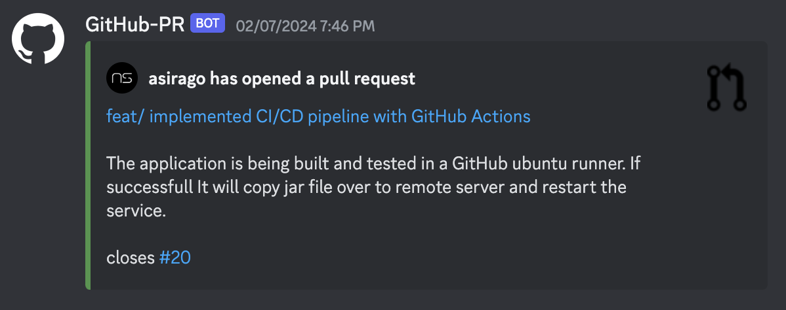

# pr-discord-notifier

**pr-discord-notifier** is a discord bot designed to enhance your development workflow by receiving real-time GitHub pull request notifications directly to discord.

## Motivation

While enrolled in the course [DD2480 Software Engineering Fundamentals](https://www.kth.se/student/kurser/kurs/DD2480?l=en) during my first year of my MSc in Computer Science, my project group and I decided to centrali allcommunications through Discord. Therefore, I built this bot to make it easier for us to stay up to date on pull requests.

## Features

The bot sends well-informed and formatted Discord embed messages with issue linking when a pull request is:

- Opened
- Edited
- Closed

**Example opened pr message**



The closed and edited embed messages follow similar formatting.

## Technologies

- Go
- AWS EC2 Free tier instance
- Discord API
- GitHub webhooks
- Caddy as a reverse proxy and automatic SSL certificate handling to expose webhook receiver endpoint through HTTPS
- GitHub Actions CI/CD pipeline

## Requirements

- **Go 1.17+**

## Installation

```bash
$ git clone https://github.com/asirago/pr-discord-notifier.git

$ cd pr-discord-notifier

$ go get .

$ go build ./...
```

## Configuration

Configurations options must be set in a TOML file.

**Example TOML file**

```toml
port = 1337
channel = "Channel ID"
guild = "Guild/Server ID"
token = "Discord Application Bot Token"
repo = "Repo you want to link to"
project = "Link to project management tool e.g. GitHub kanban"
environment = "dev | production"
```

## To run the bot locally

- Specify the name of the config file with the `--config` flag **(required)**
- The .toml file extension is **optional**

```bash
$ ./pr-discord-notifier --config config
```

or

```bash
$ ./pr-discord-notifier --config config.toml
```

## Flags and Environment variables

Corresponding fields in toml file can also be set as flags or environment variables. The prioritization order is as following:

- Flags
- Environmental variables
- TOML file

**Example of setting flags:**

```bash
$ ./pr-discord-notifier --config config.toml --port 8080 --token YOURTOKEN
```

## Bot Usage Manual

`/help` - Displays a usage manual for the available commands.

`/repo` - Retrieves the link to the GitHub repository associated with this Discord server.

`/set_repo` `[repo_link]` - Sets the link to the GitHub repository for this Discord server.

`/project` - Retrieves the link to the project management tool

`/set_project` `[project_link]` - Sets the link to the project management tool for this Discord server.

`/source` - Retrieves the link to the GitHub repository containing the source code of this Discord bot.

`/channel` - Retrieves the channel where pull request notifications will be sent.

`/set_channel` `[channel_id]` or `[#channel]` - Sets the channel for pull request notifications.

## LICENSE

This project is licensed under the terms of the [MIT License](https://opensource.org/license/mit/). See the [LICENSE](LICENSE) file for more details.
